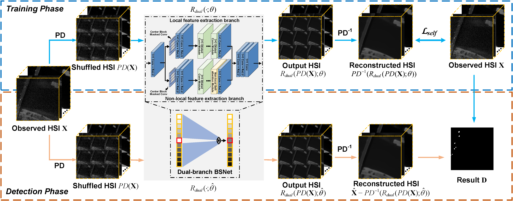
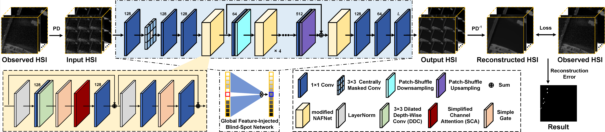
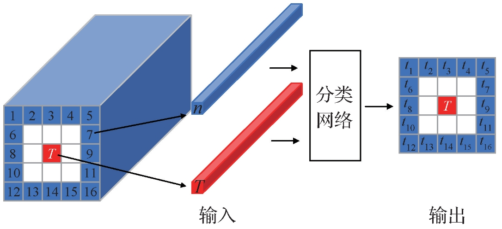
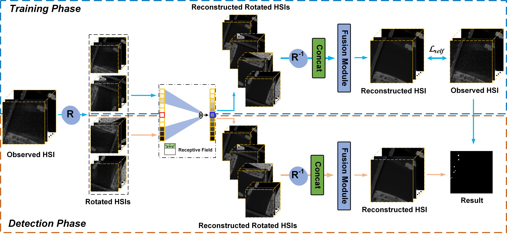
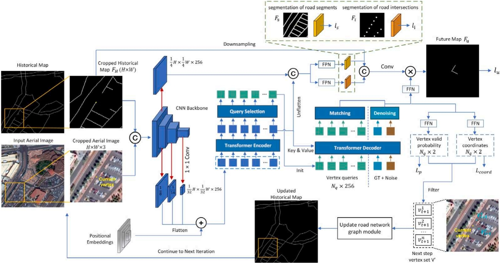
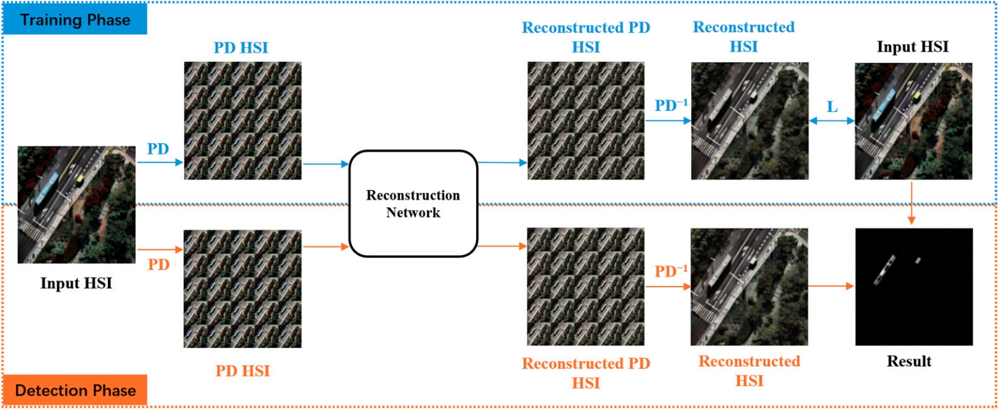
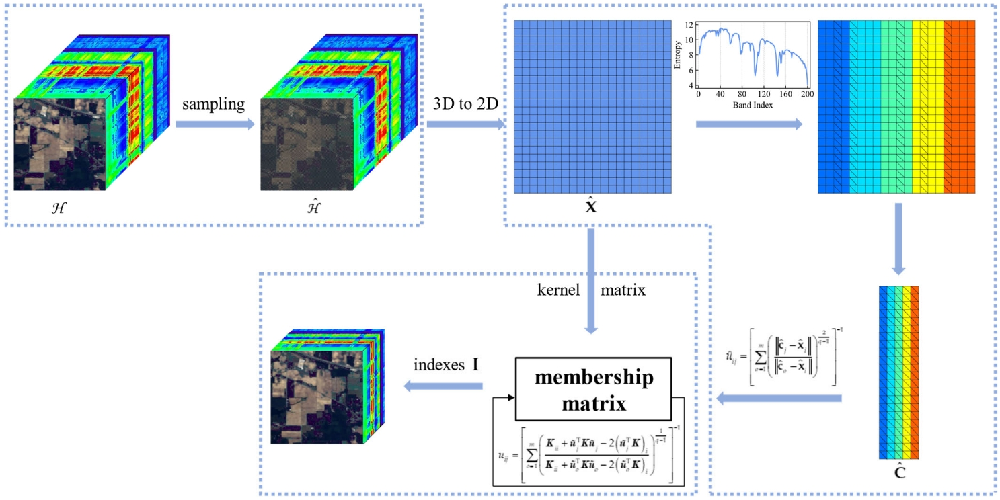








I received my Ph.D. degree from the [Aerospace Information Research Institute, Chinese Academy of Sciences](http://www.aircas.cas.cn/) on June 29, 2025, and joined [the School of Technology, Beijing Forestry University](https://gxy.bjfu.edu.cn/) on September 1, 2025. My research interests include hyperspectral remote sensing, target detection, anomaly detection, band selection, road extraction, machine learning, and deep learning. In recent years, I have published 15 academic papers, including 9 papers as the first author in journals and conferences such as IEEE TGRS/JSTARS/GRSL and CAAI TRIT. Among these, 5 papers have been selected as the **ESI Highly Cited Paper (TOP 1%)**, 1 paper has been selected as the **WILEY Top Cited Article**, and an EI conference paper has won the Excellent PAPERS Award. I served as a reviewer for over 30 SCI journals, including IEEE TIP, IEEE TGRS, IEEE JSTARS, IEEE GRSL, IF, NN, ESWA, KBS, and EAAI. I was awarded the President Scholarship for Postgraduate Students in 2025 and the National Scholarship for Doctoral Students in 2024.

王德港，1997年生，2025年于[中国科学院空天信息创新研究院](http://www.aircas.cas.cn/)获得博士学位，并入职[北京林业大学工学院](https://gxy.bjfu.edu.cn/)。研究方向为高光谱遥感、目标探测、异常检测、波段选择、道路提取、机器学习、深度学习。目前，共发表学术论文15篇，其中，以一作/学生一作身份在IEEE TGRS、CAAI TRIT等国际权威期刊和会议发表论文9篇，包括SCI论文7篇，EI会议论文1篇，CSCD论文1篇，并申请国家发明专利2项。其中，中科院1区Top论文5篇，ESI高被引论文5篇，Wiley 2023年度高被引论文1篇，EI会议论文荣获国际会议优秀论文奖。受邀担任IEEE TIP/TCSVT/TGRS/JSTARS、IF、ESWA、KBS、EAAI等30多个国际知名SCI期刊独立审稿人。先后获中国科学院院长优秀奖、博士研究生国家奖学金、中国科学院朱李月华奖学金、中国科学院大学三好学生标兵、中国科学院大学三好学生、中国科学院空天信息创新研究院优秀研究生特等奖学金、中国科学院空天信息创新研究院企业冠名奖学金一等奖、中国科学院空天信息创新研究院一等学业奖学金、中国科学院空天信息创新研究院优秀共青团员等荣誉奖励。

- Email: wangdegang@bjfu.edu.cn, wangdegang20@mails.ucas.ac.cn, wangdg1997@qq.com
- WeChat: [Together0908o_o](./images/WeChat.png)

# 🔥 News
- *2025.09.11*: &nbsp;🎉 Our paper entitled "[Non-Local and Local Feature-Coupled Self-Supervised Network for Hyperspectral Anomaly Detection](ieeexplore.ieee.org/document/10890991)" has been selected as the **ESI Highly Cited Paper (TOP 1%)**!
- *2025.07.22*: &nbsp;🎉 Our paper entitled "[A multi-angle spectral curve inversion model based on BRDF](https://journal26.magtechjournal.com/kjkxjs/CN/10.16708/j.cnki.1000-758X.2025.0056)" is published online by Chinese Space Science and Technology (ESCI, IF: 0.9, 中科院3区)!
- *2025.07.22*: &nbsp;🎉 Our paper entitled "[Continuous Tensor Representation for Hyperspectral Anomaly Detection](https://ieeexplore.ieee.org/document/11098802)" has been accepted by IEEE TGRS!
- *2025.07.08*: &nbsp;🎉 Our paper entitled "[Nonlocal and Deep Priors for Hyperspectral Anomaly Detection](https://ieeexplore.ieee.org/document/11097327)" has been accepted by IEEE TGRS!
- *2025.06.29*: &nbsp;🎉 Received Ph.D. degree from the Aerospace Information Research Institute, Chinese Academy of Sciences!
- *2025.06.16*: &nbsp;🎉 Awarded with the **President Scholarship for Postgraduate Students of Chinese Academy of Sciences (中国科学院院长优秀奖)**!
- *2025.06.03*: &nbsp;🎉 Awarded with the **Pacemaker to Merit Student of the University of Chinese Academy of Sciences (中国科学院大学三好学生标兵)**!
- *2025.04.15*: &nbsp;🎉 Our paper entitled "[Frequency-to-Spectrum Mapping GAN for Semisupervised Hyperspectral Anomaly Detection](https://ietresearch.onlinelibrary.wiley.com/doi/full/10.1049/cit2.12154)" has been selected as the **WILEY Top Cited Article**!
- *2025.03.13*: &nbsp;🎉 Our paper entitled "[BockNet: Blind-Block Reconstruction Network with a Guard Window for Hyperspectral Anomaly Detection](ieeexplore.ieee.org/abstract/document/10330742)" has been selected as the **ESI Highly Cited Paper (TOP 1%)**!

# 📖 Educations
- *2020.09 – 2025.06*: **[Key Laboratory of Computational Optical Imaging
Technology, Aerospace Information Research Institute, Chinese Academy of Sciences](http://www.aircas.cas.cn/)**
  
  *- Ph.D. degree in cartography and geography information system, Supervisors: [Lianru Gao](https://people.ucas.ac.cn/~gaolianru) (高连如，国家杰青、国家优青、IET Fellow) & [Lina Zhuang](https://sites.google.com/view/linazhuang/home) (庄丽娜，海外优青、中科院百人计划)*

- *2016.09 – 2020.06*: **[School of Electronics and Information Engineering, Hebei University of Technology](https://eie.hebut.edu.cn/index.htm)**
  
  *- B.S. degree in communication engineering*

# 💻 Work Experiences

- *2025.09 – Present*: Lecturer and Postdoc **[School of Technology, Beijing Forestry University](https://gxy.bjfu.edu.cn/)**

  *- Lab: Pioneer Team of Intelligent Forestry, Supervisor: [Junguo Zhang](https://gxy.bjfu.edu.cn/jiaozhiyuangong/jiaoshixilie/bssds/z/405254.html) (张军国，国家林草局第五批国家林草科技创新团队负责人)*

  
# 📝 Publications
More papers info., please visit: [Google Scholar Profile](https://scholar.google.com/citations?user=rB6THIoAAAAJ&hl) (530+ citations)

TGRS 2023

  
BS3LNet: A New Blind-Spot Self-Supervised Learning Network for Hyperspectral Anomaly Detection. IEEE Transactions on Geoscience and Remote Sensing, 2023, 61: 5504218.[[Link](https://ieeexplore.ieee.org/abstract/document/10049187)][[Code](https://github.com/DegangWang97/IEEE_TGRS_BS3LNet)]

Lianru Gao, **Degang Wang**, Lina Zhuang, Xu Sun, Min Huang, Antonio Plaza

- 学生一作, **SCI, IF: 8.6, 中科院1区Top, ESI 高被引论文**

TGRS 2023

  
PDBSNet: Pixel-Shuffle Downsampling Blind-Spot Reconstruction Network for Hyperspectral Anomaly Detection. IEEE Transactions on Geoscience and Remote Sensing, 2023, 61: 5511914.[[Link](https://ieeexplore.ieee.org/abstract/document/10124448)][[Code](https://github.com/DegangWang97/IEEE_TGRS_PDBSNet)]

**Degang Wang**, Lina Zhuang, Lianru Gao, Xu Sun, Min Huang, Antonio Plaza

- 第一作者, **SCI, IF: 8.6, 中科院1区Top, ESI 高被引论文**

TGRS 2023

  
BockNet: Blind-Block Reconstruction Network with a Guard Window for Hyperspectral Anomaly Detection. IEEE Transactions on Geoscience and Remote Sensing, 2023, 61: 5531916.[[Link](ieeexplore.ieee.org/abstract/document/10330742)][[Code](https://github.com/DegangWang97/IEEE_TGRS_BockNet)]

**Degang Wang**, Lina Zhuang, Lianru Gao, Xu Sun, Min Huang, Antonio Plaza

- 第一作者, **SCI, IF: 8.6, 中科院1区Top, ESI 高被引论文**

TGRS 2024

  
Sliding Dual-Window-Inspired Reconstruction Network for Hyperspectral Anomaly Detection. IEEE Transactions on Geoscience and Remote Sensing, 2024, 62: 5504115.[[Link](ieeexplore.ieee.org/abstract/document/10400466)][[Code](https://github.com/DegangWang97/IEEE_TGRS_DirectNet)]

**Degang Wang**, Lina Zhuang, Lianru Gao, Xu Sun, Xiaobin Zhao, Antonio Plaza

- 第一作者, **SCI, IF: 8.6, 中科院1区Top, ESI 高被引论文**

CAAI TRIT 2023

  
Frequency-to-Spectrum Mapping GAN for Semisupervised Hyperspectral Anomaly Detection. CAAI Transactions on Intelligence Technology, 2023, 8(4): 1258-1273.[[Link](https://ietresearch.onlinelibrary.wiley.com/doi/full/10.1049/cit2.12154)]

**Degang Wang**, Lianru Gao, Ying Qu, Xu Sun, Wenzhi Liao

- 第一作者, **SCI, IF: 7.3, 中科院1区Top, Wiley 2023年度高被引论文**

JSTARS 2025

  
Non-Local and Local Feature-Coupled Self-Supervised Network for Hyperspectral Anomaly Detection. IEEE Journal of Selected Topics in Applied Earth Observations and Remote Sensing, 2025, 18: 6981-6993.[[Link](ieeexplore.ieee.org/document/10890991)][[Code](https://github.com/DegangWang97/IEEE_JSTARS_NL2Net)]

**Degang Wang**, Longfei Ren, Xu Sun, Lianru Gao, Jocelyn Chanussot

- 第一作者, **SCI, IF: 5.3, 中科院2区**

GRSL 2024

  
Global Feature-Injected Blind-Spot Network for Hyperspectral Anomaly Detection. IEEE Geoscience and Remote Sensing Letters, 2024, 21: 5509305.[[Link](ieeexplore.ieee.org/document/10648847)][[Code](https://github.com/DegangWang97/IEEE_GRSL_PUNNet)]

**Degang Wang**, Lina Zhuang, Lianru Gao, Xu Sun, Xiaobin Zhao

- 第一作者, **SCI, IF: 4.4, 中科院3区**

JIG 2021

  
结合孪生网络和像元配对的高光谱图像异常检测. 中国图象图形学报, 2021, 26(08): 1860-1870.[[Link](https://www.cjig.cn/thesisDetails#10.11834/jig.210073&lang=zh)]

**王德港**, 饶伟强, 孙旭, 渠瀛, 刘雪梅, 高连如

- 第一作者, CSCD, **中国科技期刊提能拓展计划**

RSMG 2023

  
Blind-Block Reconstruction Network with a Guard Window for Hyperspectral Anomaly Detection. 2023 International Conference on Remote Sensing, Mapping and Geographic Information Systems. SPIE, 2023: 128152E.[[Link](https://www.spiedigitallibrary.org/conference-proceedings-of-spie/12815/128152E/Blind-block-reconstruction-network-with-a-guard-window-for-hyperspectral/10.1117/12.3010359.short)]

**Degang Wang**, Lina Zhuang, Lianru Gao, Xu Sun, Ye Liu

- 第一作者, EI

JAG 2024

  
A Deeply Supervised Vertex Network for Road Network Graph Extraction in High-Resolution Images. International Journal of Applied Earth Observation and Geoinformation. 2024, 133: 104082.[[Link](https://www.sciencedirect.com/science/article/pii/S1569843224004369)]

Yu Zhao, Zhengchao Chen, Zhujun Zhao, Cong Li, Yongqing Bai, Zhaoming Wu, **Degang Wang**, Pan Chen

- 第七作者, **SCI, IF: 8.6, 中科院1区Top**

RS 2024

  
Large-Kernel Central Block Masked Convolution and Channel Attention-Based Reconstruction Network for Anomaly Detection of High-Resolution Hyperspectral Imagery. Remote Sensing. 2024, 16(22): 4125.[[Link](https://www.mdpi.com/2072-4292/16/22/4125)]

Qiong Ran, Hong Zhong, Xu Sun, **Degang Wang**, He Sun

- 第四作者, **SCI, IF: 4.1, 中科院2区**

RS 2022

  
Spatial Sampling and Grouping Information Entropy Strategy Based on Kernel Fuzzy C-Means Clustering Method for Hyperspectral Band Selection. Remote Sensing, 2022, 14(19): 5058.[[Link](https://www.mdpi.com/2072-4292/14/19/5058)]

Zhou Zhang, **Degang Wang**, Xu Sun, Lina Zhuang, Rong Liu, Li Ni

- 第二作者, **SCI, IF: 4.1, 中科院2区**

# 🏅 Honors and Awards
- *2025*: &nbsp;💰 **中国科学院院长优秀奖** – 5,000 CNY
- *2025*: &nbsp;🏅 中国科学院大学2024-2025学年三好学生标兵
- *2025*: &nbsp;🏅 中国科学院空天信息创新研究院优秀学术报告荣誉
- *2024*: &nbsp;💰 **博士研究生国家奖学金** – 30,000 CNY
- *2024*: &nbsp;🏆 第八届全国成像光谱对地观测学术研讨会优秀论文奖（序1）
- *2024*: &nbsp;💰 中国科学院空天信息创新研究院学业奖学金一等奖 – 16,000 CNY
- *2024*: &nbsp;🏆 第一届山海杯国土空间数字化场景工具创新大赛优秀奖（序7）
- *2024*: &nbsp;💰 **2024年度中国科学院空天信息创新研究院优秀研究生特等奖学金** – 12,000 CNY
- *2024*: &nbsp;🏅 中国科学院空天信息创新研究院2023-2024年度优秀共青团员
- *2023*: &nbsp;🏆 第三届中国图象图形学报研究生学术论坛突出报告奖
- *2023*: &nbsp;💰 **2023年度中国科学院大学朱李月华奖学金** – 5,000 CNY
- *2023*: &nbsp;🏆 《遥感学报》研究生学术论坛三等奖
- *2023*: &nbsp;🏆 国际学术会议RSMG 2023优秀论文奖
- *2023*: &nbsp;🏆 国际学术会议RSMG 2023最佳口头报告奖
- *2023*: &nbsp;💰 2023年度中国科学院空天信息创新研究院企业冠名奖学金一等奖 – 5,000 CNY
- *2022*: &nbsp;💰 中国科学院空天信息创新研究院学业奖学金一等奖 – 15,000 CNY
- *2022*: &nbsp;🏅 中国科学院大学2021-2022学年三好学生

# 📃 Reviewer

- IEEE Transactions on Image Processing
- IEEE Transactions on Geoscience and Remote Sensing
- IEEE Journal of Selected Topics in Applied Earth Observations and Remote Sensing 
- IEEE Geoscience and Remote Sensing Letters
- IEEE Access
- Remote Sensing
- Journal of Applied Remote Sensing
- Information Fusion
- Knowledge-Based Systems
- Expert Systems with Applications
- Information Processing and Management
- Engineering Applications of Artificial Intelligence
- Applied Soft Computing
- Neural Networks
- Computer Vision and Image Understanding
- Neurocomputing
- Measurement
- Applied Artificial Intelligence
- Scientific Reports
- Infrared Physics and Technology
- Pattern Recognition Letters
- Multimedia Systems
- IET Image Processing
- The Journal of Supercomputing
- Journal of Electronic Imaging
- PLOS One
- Journal of Circuits, Systems, and Computers
- PeerJ Computer Science
- Signal, Image and Video Processing
- Journal of Real-Time Image Processing
- Remote Sensing Applications: Society and Environment
- International Journal of Data Science and Analytics
- Multimodal Transportation
- IEEE International Geoscience and Remote Sensing Symposium
- ...

  
  
  
  
  

<footer class="site-footer">
  
&copy; 2025 Degang Wang. All rights reserved.

  

    Template adapted from
    <a href="https://github.com/zhiyuansu0326/zhiyuansu0326.github.io"
       target="_blank" rel="noopener">Zhiyuan Su</a>.
  

</footer>
